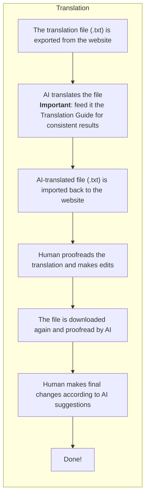

# Translation Process 🕒

While the translation could be done manually, I use a special process to speed everything up.

I use AI for translation and proofreading. And while I am not a big fan of LLMs, they significantly speed up the process and save a lot of prescious time.

The process is as follows:

