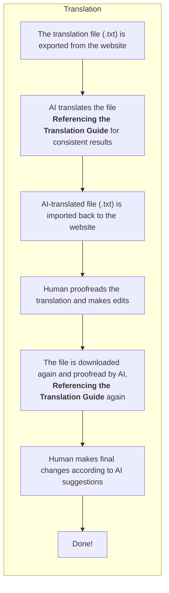

# Translation Process 🕒

While the whole translation could be done manually, I use AI (Gemini, mostly) to help with the process. It reduces the amount of manual labor, speeds up the translation and improves consistency.

> **⚠ Note:** I'm personally  not a big fan of large language models (LLMs), because they raise serious ethical concerns: the electricity and water they consume, the forests cut for placing data centers, and the content scraped without its creators' consent, among others.
> 
> Even so, I ultimately decided that using AI for this translation is worth it. It dramatically cuts the time the work takes and it improves consistency, because the AI can cross-reference the translation guide and glossary while proofreading in a way that is hard to match by hand.
>
> I am also thinking about using Agentic AI in the future to further automate and streamline the process.

The current process is as follows:

```mermaid
flowchart TB
subgraph Row1["Translation"]
direction TB
A["The translation file (.txt) is exported from the website"]
B["AI translates the file<br><b>Referencing the Translation Guide</b> for consistent results"]
C["AI-translated file (.txt) is imported back to the website"]
D["Human proofreads the translation and makes edits"]
E["The file is downloaded again and proofread by AI,<br><b>Referencing the Translation Guide</b> again"]
F["Human makes final changes according to AI suggestions"]
G["Done!"]
A --> B --> C --> D --> E --> F --> G
end
```
