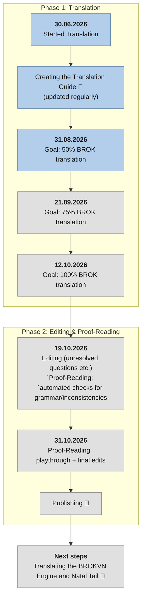

# Roadmap 🗺️

The project started as a tribute to BROK: The Investigator, a game which brought me joy and nostalgia towards classic Point & Click adventures.

The translation started on 30.06.2026 and is still ongoing. I plan to finish it by 31.10.2026, but it depends on my schedule.

More detailed information can be seen in the diagram.

